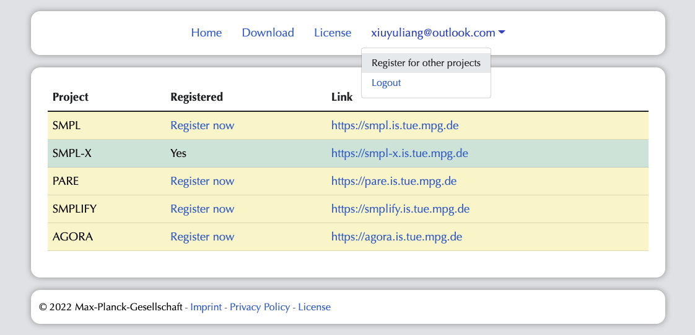
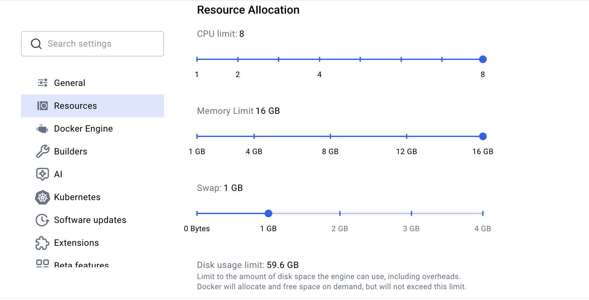
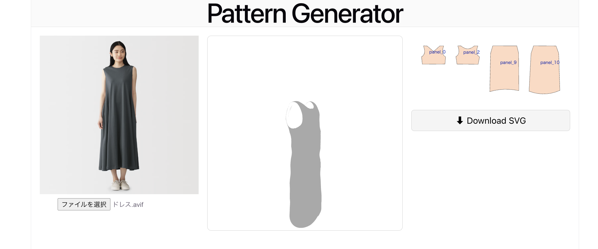

# original-cloth-pattern

本プロジェクトは、洋服を着たモデルの画像をアップロードすると、3Dの洋服モデルと、型紙を生成してくれるウェブアプリです。
本プロジェクトは、以下の2つの論文を参考に実装したシステムです。

### デモ動画
https://drive.google.com/file/d/1bqw1g4vKhnC68ag96qTiGDBD2t_YPuSZ/view?usp=sharing

## References

本プロジェクトでは以下の論文および実装を参考にしています。

### GarVerseLOD
- **論文**
  High-Fidelity 3D Garment Reconstruction from a Single In-the-Wild Image using a Dataset with Levels of Details
  https://arxiv.org/abs/2411.03047

- **GitHub**
  https://github.com/zhongjinluo/GarVerseLOD

---

### NeuralTailor
- **論文**
  Reconstructing Sewing Pattern Structures from 3D Point Clouds of Garments
  https://arxiv.org/abs/2201.13063

- **GitHub**
  https://github.com/maria-korosteleva/Garment-Pattern-Estimation

## 実行方法
## git clone
`git clone git@github.com:100pro-sewing-pattern-generator/original-cloth-pattern.git`

`cd original-cloth-pattern`

## データとモデルのダウンロード
### supportデータのダウンロード
以下のリンクから必要なデータをダウンロードしてください：

https://drive.google.com/file/d/1ylz5EoVFPmEAhO1cwUjO_zfa-oz5n608/view

ダウンロード後解体し(`support_data`)、/backend/mesh-generator/demo/dress_demo/に配置してください。

### ICONのダウンロード
`https://icon.is.tue.mpg.de/` ここでユーザーネームと、パスワードを入力しサインインします

 ユーザー名の下の `Register for other projects` をクリックし、SMPL, SMPL-X, SMPLIFYのprojectの`Register now`をおし、Yesにします。

下の二つのコマンドで、ダウンロードします。

`bash backend/mesh-generator/demo/dress_demo/1_coarse/ICON_get_smpl/fetch_data.sh`

`bash backend/mesh-generator/demo/dress_demo/1_coarse/ICON_get_smpl/fetch_hps.sh`

### 背景除去モデルのダウンロード
`mkdir -p ./models`

`wget https://github.com/danielgatis/rembg/releases/download/v0.0.0/u2net.onnx -O ./models/u2net.onnx`

## Dockerのメモリ設定
このプロジェクトはメモリをたくさん使うため、dockerのRAMメモリを16Gに調整します。

## DockerのImageの作成
`docker compose pull`
`docker compose build`

## コンテナの作成
`docker compose down`

`docker compsoe up`

### 動作確認
`http://localhost:5173/`をブラウザに貼り付ける

画像をアップロードすると、左にアップロードされた画像、真ん中に3D画像、右に型パターンが表示されます。

